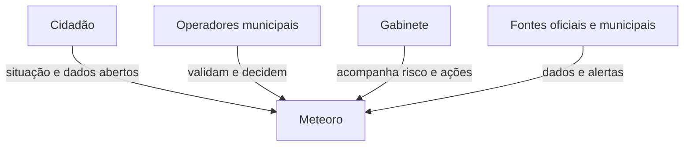
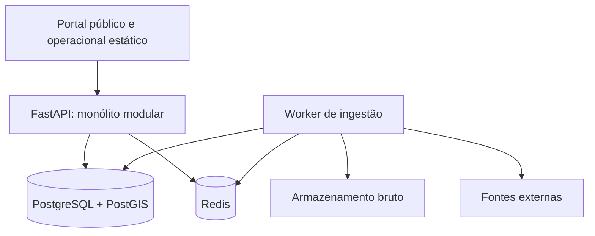

# Arquitetura C4 e decisões registradas

## C4 — Contexto

## C4 — Contêineres implementados no MVP

O servidor FastAPI entrega a API versionada e o portal em `/portal`. O worker executa em processo separado, com fila Redis e lock distribuído por fonte. O armazenamento bruto local é uma implementação de desenvolvimento; produção deve apontar para armazenamento de objetos compatível com S3, com retenção definida.

## C4 — Componentes do backend

| Área | Módulos presentes |
| --- | --- |
| Núcleo | identity, audit, catalog, geospatial |
| Dados | ingestion, data_quality, meteorology |
| Operação | alerts, incidents, recommendations, communications, planning |
| Interfaces | public e API REST/OpenAPI |

## ADRs

| ADR | Decisão | Estado |
| --- | --- | --- |
| ADR-001 | Monólito modular com APIs internas bem definidas | adotada |
| ADR-002 | PostgreSQL/PostGIS como núcleo relacional e geoespacial | adotada no Compose e migrations |
| ADR-003 | Payload bruto imutável com hash, origem e versão | adotada na ingestão |
| ADR-004 | Alertas e protocolos por regras transparentes e aprovação humana | adotada parcialmente; regras devem ser homologadas por área competente |
| ADR-005 | ML opcional e desacoplado da operação | adotada; ML não integra o MVP operacional |
| ADR-006 | Site público e portal interno com superfícies e autorização distintas | adotada; endurecimento de perfis e publicação continua incremental |
| ADR-007 | Sem multitenancy/empresas no MVP municipal | adotada |

## Restrições deliberadas

- METAR/SPECI é contexto regional: não deve ser exibido como medição de bairro de Betim.
- Foco de calor de satélite é `DETECTADO_POR_SATÉLITE`, não ocorrência confirmada.
- Previsão, observação, alerta oficial e inferência são entidades distintas.
- Dados de saúde e denúncias individualizadas ficam fora da superfície pública e exigem controles específicos.
